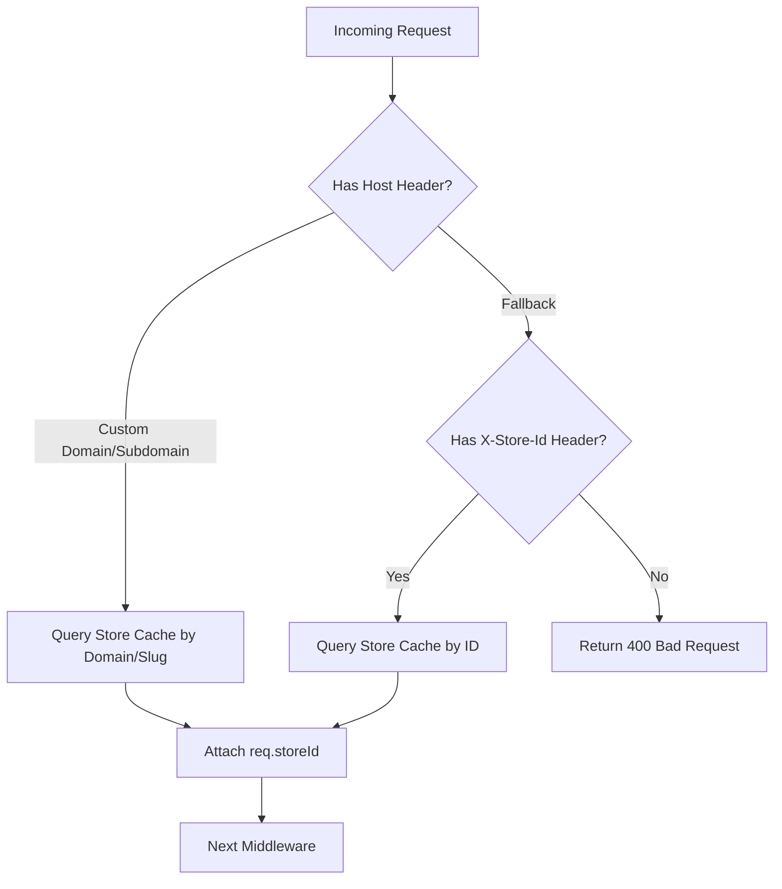
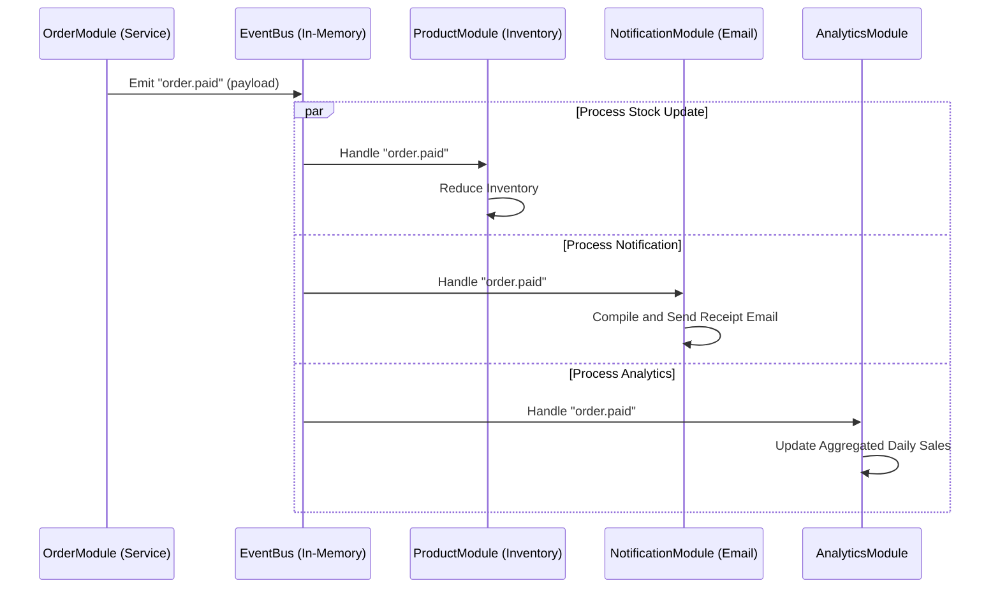
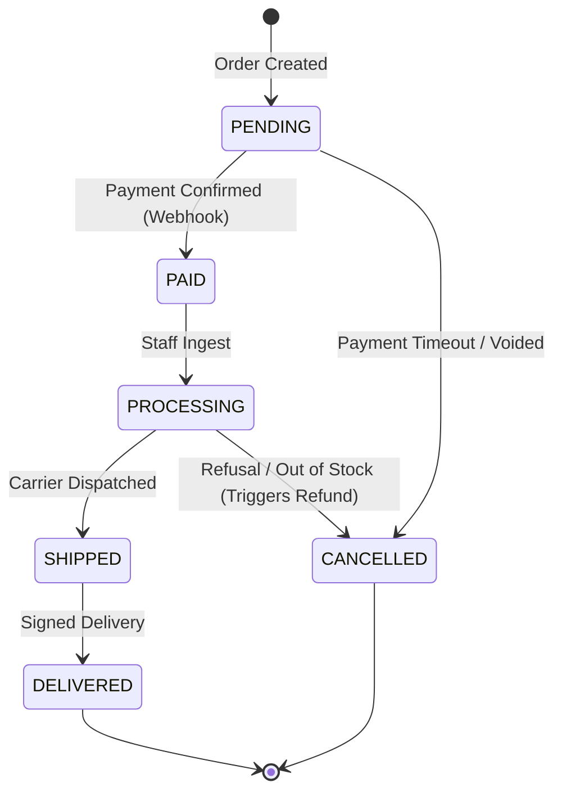

# Refined Business Strategy

Do **not position this as a SaaS initially**.

You are a solo founder building a reusable product.

The better model is:

## Business Model

### Productized Agency + White Label Platform

You build one backend platform.

Then deploy it for:

* Jewellery Stores
* Fashion Stores
* Salons
* Gyms
* Clinics
* Furniture Stores
* Electronics Stores
* Restaurants

Only branding, theme, and business modules change.

The core backend remains the same.

This reduces development by 80%.

---

# Product Vision

## CommerceOS

A reusable multi-business commerce platform that combines:

* Website CMS
* Product Catalog
* E-commerce
* CRM
* Appointment Booking
* Lead Management
* Blog CMS
* Analytics
* AI Chat Widget (Future)

For MVP:

**JewelleryOS = First Vertical**

Later:

* SalonOS
* GymOS
* FashionOS
* ClinicOS

All powered by the same backend.

---

# Database Recommendation

## Choose MongoDB

For your current stage:

**Advantages:**
* Faster development
* Flexible schema
* Easier for multi-business types
* Perfect with Node.js
* No migration headaches initially

Example:

*Jewellery Product:*
```json
{
  "purity": "22K",
  "weight": 15
}
```

*Fashion Product:*
```json
{
  "size": ["S","M","L"],
  "color": ["Black"]
}
```
*Both stored in the same `products` collection.*

### Future Migration

Design services and repository abstractions cleanly:

```txt
Controller ➔ Service ➔ Repository ➔ Database (Mongoose)
```

By decoupling database-specific logic into a Repository layer, the database can eventually be switched to PostgreSQL or MySQL without altering the core business services.

---

# Backend Architecture Specification

## Project Name
CommerceOS Backend

**Version:** 1.0  
**Architecture:** Modular Monolith (not microservices, to minimize infrastructure complexity and development overhead for a solo founder).

---

## Tech Stack & Core Libraries

*   **Runtime:** Node.js (v20+ LTS)
*   **Framework:** Express.js with TypeScript
*   **Database:** MongoDB via Mongoose
*   **Validation:** Zod
*   **Security:** Helmet, CORS, Express Rate Limit, bcrypt
*   **Logging:** Winston (JSON format for production logs)
*   **API Documentation:** Swagger UI (Express Swagger Generator)
*   **File Upload:** Cloudinary SDK (later AWS S3)
*   **Email:** Nodemailer (using SMTP or Resend API wrapper)
*   **Scheduler:** node-cron
*   **Cache:** Redis (optional future addition; database queries cached in-memory initially)

---

## Directory Structure

To maintain clean modular boundaries, the application follows a module-based structure:

```txt
src/
├── config/                  # Global configuration (env, DB connections, Cloudinary)
├── shared/                  # Reusable utility code across modules
│   ├── middleware/          # Global middleware (auth, tenant, rate limiter, error handler)
│   ├── utils/               # Helpers (API responses, custom error classes)
│   ├── constants/           # Error codes, role definitions, enum limits
│   └── database/            # Global connection pools and transaction helpers
└── modules/                 # Self-contained business modules
    ├── auth/                # Sign-in, sign-up, refresh, password resets
    ├── users/               # Administrative platform users
    ├── stores/              # Tenant configuration, dynamic settings, modules state
    ├── products/            # Catalog, dynamic attributes, pricing matrices
    ├── categories/          # Hierarchical category trees
    ├── media/               # Upload handlers, directory structures
    ├── cms/                 # Custom layout engines (page templates, layout JSON)
    ├── blogs/               # Articles, publish schedulers
    ├── leads/               # CRM Pipeline, contact submissions, event logs
    ├── appointments/        # Time-slot bookings, calendars, availability engine
    ├── customers/           # Buyer profile directories, purchase histories
    ├── orders/              # Carts, checkouts, payment processing, tax logic
    ├── calculators/         # Domain calculators (Gold, EMI, Investment)
    ├── analytics/           # Ingest engines, daily agg aggregators
    └── chatbot/             # Chat widget config, FAQ mapping, document vectors
```

---

## Multi-Tenancy Architecture

CommerceOS implements a **Single Database, Shared Schema** multi-tenancy model to minimize hosting costs while ensuring simple tenant isolation.

### 1. Tenant Resolution Flow
Each API request must resolve the target tenant. The resolution follows this precedence order in the `tenantResolver` middleware:

1.  **Custom Domain Header:** The API Gateway (e.g., Caddy or Cloudflare) routes request, and the server identifies the tenant by the `Host` header.
2.  **Subdomain Check:** If the host matches `*.commerceos.com`, the subdomain string acts as the tenant `slug`.
3.  **Explicit Header:** Developer-facing and admin calls can pass an `X-Store-Id` header.



### 2. Mongoose Tenant Isolation Middleware
To prevent accidental data exposure across tenants, all tenant-specific collections must contain a `storeId` field. 

A query helper or schema plugin automatically adds the tenant filter to query operations (`find`, `findOne`, `update`, `count`, etc.):

```typescript
// Shared Mongoose Tenant Plugin
import { Schema, Query } from 'mongoose';

export function tenantPlugin(schema: Schema) {
  schema.add({ storeId: { type: Schema.Types.ObjectId, ref: 'Store', required: true, index: true } });

  // Intercept find queries to inject tenant filter
  schema.pre(/^find/, function (this: Query<any, any>, next) {
    const filter = this.getFilter();
    // Only apply if storeId isn't explicitly defined in query (allows super-admin operations if skipped)
    if (filter.storeId === undefined && (this as any).options?.skipTenantCheck !== true) {
      // The storeId is injected from global context (e.g., Express Request lifecycle storage or async local storage)
      const storeId = global.tenantContext?.storeId; 
      if (storeId) {
        this.where({ storeId });
      }
    }
    next();
  });
}
```

### 3. Database Indexes
To maintain high performance as the customer count scales, a compound index MUST be declared on all tenant-specific collections:
*   `{ storeId: 1, _id: 1 }` (Default document fetch)
*   `{ storeId: 1, slug: 1 }` (Uniqueness scoped per tenant)
*   `{ storeId: 1, createdAt: -1 }` (Sorted list queries)

---

## Modular Monolith Communication Rules

To ensure modules remain loosely coupled, code must adhere to these separation rules:

1.  **Database Separation:** A module must **never** import a Mongoose Model belonging to another module. (e.g., `OrderService` must not directly import or query `ProductModel`). Instead, it must invoke `ProductService.getById()`.
2.  **Synchronous Communication:** Invoking synchronous code across modules is done via clear, exported **Service Facades**. Circular imports must be strictly avoided.
3.  **Asynchronous Communication (Decoupled):** For actions that trigger side effects (e.g., "Order Paid" triggers stock reduction, emails, and CRM notes), the originating module must emit a local event via a centralized `EventEmitter` wrapper. Other modules register event listeners.



---

## Extensible Product Catalog & Attribute Validation Engine

Because the platform caters to diverse business types (Jewellery, Fashion, Clinics), the product database must support dynamic attributes without causing schema bloat.

### 1. Custom Attributes Schema Design
The `Product` schema features a generic object map:

```typescript
const ProductSchema = new Schema({
  name: { type: String, required: true },
  slug: { type: String, required: true },
  sku: { type: String, required: true },
  price: { type: Number, required: true },
  customAttributes: { type: Map, of: Schema.Types.Mixed }, // Flexible KV store
});
```

### 2. Dynamic Attribute Validation Engine
To ensure dynamic fields are validated, each `Store` (or `Category`) defines an `AttributeSchemaDefinition`:

```json
[
  {
    "key": "purity",
    "label": "Gold Purity",
    "type": "select",
    "required": true,
    "options": ["18K", "22K", "24K"]
  },
  {
    "key": "weight",
    "label": "Gross Weight (g)",
    "type": "number",
    "required": true
  }
]
```

At validation time, the dynamic validator queries the active catalog schema rules and builds a runtime Zod validator:

```typescript
import { z } from 'zod';

export function buildDynamicZodSchema(definitions: any[]) {
  const shape: Record<string, z.ZodTypeAny> = {};

  definitions.forEach((def) => {
    let validator: z.ZodTypeAny;

    switch (def.type) {
      case 'number':
        validator = z.number();
        break;
      case 'select':
        validator = z.enum(def.options as [string, ...string[]]);
        break;
      default:
        validator = z.string();
    }

    if (!def.required) {
      validator = validator.optional();
    }

    shape[def.key] = validator;
  });

  return z.object(shape);
}
```

---

# Core Module Specifications

## Module 1: Authentication & Authorization
Manages multi-tenant identity verification.

*   **Authentication Flow:** Token-based authentication using **Access Tokens** (JWT, short-lived, e.g., 15 mins) and **Refresh Tokens** (stored in HTTP-Only, Secure, SameSite cookies, long-lived, e.g., 7 days).
*   **Role-Based Access Control (RBAC):**
    *   `super_admin`: Full access to configure tenants, view subscriptions, access cluster logs.
    *   `store_owner`: Admin of a single store. Access to settings, database exports, staff addition.
    *   `manager`: Manage products, view CRM leads, edit CMS pages, handle bookings.
    *   `staff`: Fulfill orders, check in customers, update appointment status.
*   **Permissions Matrix:**
    *   Each route checks user role permissions using authorization middleware: `checkRole(['store_owner', 'manager'])`.

---

## Module 2: Store Management & Tenant Settings
Defines the structure and active features of a specific store.

*   **Field Specifications:**
    *   `name`: Brand name.
    *   `slug`: Unique identifier for subdomain matching.
    *   `customDomain`: DNS target string (e.g., `shop.jewellerystore.com`).
    *   `businessType`: Enum (`Jewellery`, `Fashion`, `Salon`, `Gym`, `Clinic`).
    *   `activeModules`: String array listing enabled packages (e.g., `["cms", "leads", "booking"]`). Used by route-guards to disable endpoints if a store is on a lower tier.
    *   `settings`: Object containing localized tax codes, default currency, time zone, standard working hours, and social IDs.

---

## Module 3: User & Team Management
Governs staff profile directories.

*   **Invitations Flow:**
    1.  Store Owner sends an invitation via `POST /users/invite`.
    2.  System generates a secure token and emails an sign-up invitation link (`/accept-invite?token=xyz`).
    3.  Recipient registers, linking their account to the target `storeId` with the pre-assigned role.

---

## Module 4: Product Catalog & Category Management
Houses item registries.

*   **Validation Rules:** SKU must be unique within a given `storeId`.
*   **Categories:** Stored as an adjacency list. Sub-categories reference parent category IDs:
    ```typescript
    CategorySchema {
      name: String,
      parentId: { type: Schema.Types.ObjectId, ref: 'Category', default: null }
    }
    ```

---

## Module 5: Media Storage & Folder Organization
Integrates with Cloudinary to host visual assets.

*   **Optimization Strategy:** Image uploads pass through an Express-multer layer, resize on the fly to WebP format, and stream to Cloudinary folder blocks structured as `/{storeId}/{module_name}/`.

---

## Module 6: CMS (Content Management System)
Powers customizable landing pages.

*   **Layout Schema:** Pages are defined by structured JSON containing modular sections. This avoids raw HTML injection vulnerabilities and lets the frontend render layouts programmatically:
    ```json
    {
      "page": "home",
      "sections": [
        {
          "type": "hero",
          "heading": "Exquisite Bridal Sets",
          "subtitle": "Crafted in 22K Gold",
          "backgroundImage": "https://res.cloudinary.com/..."
        },
        {
          "type": "product-carousel",
          "categorySlug": "bridal-gold"
        }
      ]
    }
    ```

---

## Module 7: Blog CMS
Allows stores to post content for organic SEO ranking.

*   **States:** `DRAFT` ➔ `PUBLISHED` ➔ `SCHEDULED`.
*   **Cron Scheduler:** Every hour, a cron job checks for `SCHEDULED` posts with matching release times and changes their status to `PUBLISHED`.

---

## Module 8: CRM & Lead Management
Tracks customer interactions.

*   **Activities Log:** Leads contain an array of activities to log history:
    ```typescript
    Activity {
      type: 'status_change' | 'note_added' | 'email_sent';
      content: String;
      performedBy: ObjectId;
      createdAt: Date;
    }
    ```

---

## Module 9: Appointment Booking & Service Scheduling
Handles scheduling for salons, clinics, and customer visits.

*   **Slots Generation Logic:** To calculate available slots for a given day:
    1.  Fetch store working hours and business holiday settings.
    2.  Query active staff schedules and their existing bookings for the day.
    3.  Compute open slots by slicing the day's timeline based on the service duration.
    4.  Exclude overlapping bookings.

```mermaid
gantt
    title Slot Allocation Flow
    dateFormat  HH:mm
    axisFormat %H:%M
    section Working Hours
    Store Hours :active, 09:00, 18:00
    section Staff Schedule
    Staff Shift : 09:00, 17:00
    section Bookings
    Existing Appt :crit, 10:00, 11:00
    Lunch Break :crit, 13:00, 14:00
    section Open Slots
    Slot 1 :done, 09:00, 10:00
    Slot 2 :done, 11:00, 12:00
    Slot 3 :done, 12:00, 13:00
    Slot 4 :done, 14:00, 15:00
    Slot 5 :done, 15:00, 16:00
    Slot 6 :done, 16:00, 17:00
```



---

## Module 10: Customer Management
Central repository for buyer directory details, containing contact details, loyalty metrics, and historical logs.

---

## Module 11: E-commerce Engine
Handles checkout, calculations, and payment gateway flow.

### 1. Order Status Transition State Machine


### 2. Payment Gateway & Webhook Verification Flow
1.  **Checkout Initialization:** Client posts items to `POST /orders/checkout`.
2.  **Server Calculations:** The backend validates item stock, applies discount coupon, calculates tax percentage, and computes final total price.
3.  **Payment Intent Generation:**
    *   *Stripe:* Backend generates a Stripe PaymentIntent and returns the client secret.
    *   *Razorpay:* Backend generates a Razorpay Order ID.
4.  **Pending Record:** Backend saves the order in `PENDING` state.
5.  **Webhook Trigger:** Upon successful payment, Stripe/Razorpay issues an encrypted webhook payload.
6.  **Webhook Verification:**
    *   Express app intercepts raw payload using verification signatures.
    *   Updates Order state to `PAID` or `PROCESSING`.
    *   Decrements product catalog inventory.
    *   Fires `order.paid` event.

---

## Module 12: Calculators Engine
Provides embeddable utility calculations (Gold Value, EMI, Loan repayment calculations). Input parameters dynamically calculate returns without storing transaction state.

---

## Module 13: Analytics & Reporting
Stores daily consolidated logs to limit execution costs:
*   Instead of scanning raw transaction tables for analytics queries, the backend uses a daily aggregate collection: `DailyMetrics { storeId, date, salesTotal, orderCount, leadsCaptured, visits }`.
*   A cron job runs at 23:59:00 local time to summarize events and write to this collection.

---

## Module 14: Notification System
Centralizes communication. Exposes a dispatch service:
```typescript
interface MailPayload {
  to: string;
  template: 'order_receipt' | 'appointment_booked' | 'lead_alert';
  context: Record<string, any>;
}
// Centralized wrapper using Nodemailer/Resend templates
```

---

## Module 15: Chatbot Configuration & Knowledge Base
Platform to build AI widgets. Allows uploading PDF files or writing FAQ structures. Saved URLs are fed into vector-ingestion indices during Phase 2.

---

# Global API Standards

To keep client integration simple and robust, all endpoints must use standard formats.

### 1. Standard Response Wrapper
*Success (200 OK, 201 Created):*
```json
{
  "success": true,
  "data": {
    "id": "603d2bfa12a3...",
    "name": "Gold Pendant"
  },
  "message": "Resource processed successfully"
}
```

*Error (4xx, 5xx):*
```json
{
  "success": false,
  "error": {
    "code": "VALIDATION_FAILED",
    "message": "Required fields are missing",
    "details": [
      {
        "field": "price",
        "issue": "Price must be a positive number"
      }
    ]
  }
}
```

### 2. Error Code Registry
*   `UNAUTHORIZED`: Missing or expired access tokens.
*   `FORBIDDEN`: User role lacks permission for target resource.
*   `NOT_FOUND`: Resource could not be resolved.
*   `VALIDATION_FAILED`: Schema check failed during ingest.
*   `INSUFFICIENT_STOCK`: Stock run-out check failed.
*   `INTERNAL_SERVER_ERROR`: Fallback code for generic node crashes.

### 3. Query Filters, Pagination, & Sorting Rules
All list endpoints (`GET /products`, `GET /leads`, etc.) support standard queries:
*   `page`: Number index (defaults to `1`).
*   `limit`: Page size limit (defaults to `20`, capped at `100`).
*   `sort`: Sort string (e.g. `-createdAt` for descending, `price` for ascending).
*   `filter`: Query parameters (e.g., `status=PENDING`).

---

# DevOps, Deployment, & White-Labeling Infrastructure

To support white-label domains (e.g., matching client-purchased DNS targets like `shop.jewellerystore.com` to the core backend instances):

### 1. Custom Domain Routing Flow
```txt
Client Browser ➔ DNS A/CNAME Record ➔ Reverse Proxy (Caddy Gateway) ➔ CommerceOS Server
```
*   Clients configure their custom domains with a CNAME record pointing to `cname.commerceos.com`.
*   A Caddy reverse proxy server routes traffic to our backend application.

### 2. Automated SSL Certificates via Caddy Dynamic TLS
The Caddy configuration uses the `on_demand_tls` feature to request SSL certificates dynamically. When an unknown domain requests HTTPS connection, Caddy queries our backend endpoint before initiating Let's Encrypt generation:

```caddy
# Caddyfile Example
{
    on_demand_tls {
        ask http://localhost:5000/api/v1/stores/verify-domain
        interval 2m
        burst 5
    }
}

:443 {
    tls {
        on_demand
    }
    reverse_proxy localhost:5000
}
```

**Backend verification route (`/api/v1/stores/verify-domain`):**
*   Returns `200 OK` if the request query parameter `?domain=shop.jewellerystore.com` matches an active tenant in the `stores` collection.
*   Returns `404 Not Found` to reject SSL requests for unmapped domains, blocking certificate spam attacks.

---

# Sprint Roadmap

```txt
┌──────────┐     ┌──────────┐     ┌──────────┐     ┌──────────┐
│ SPRINT 1 │ ──> │ SPRINT 2 │ ──> │ SPRINT 3 │ ──> │ SPRINT 4 │
│ Auth/Store     │ Catalog  │     │ CMS/Blog │     │ CRM/Book │
└──────────┘     └──────────┘     └──────────┘     └──────────┘
                                                        │
┌──────────┐     ┌──────────┐     ┌──────────┐          │
│ SPRINT 7 │ <── │ SPRINT 6 │ <── │ SPRINT 5 │ <────────┘
│ Admin/Deploy   │ Analytics│     │ Checkout │
└──────────┘     └──────────┘     └──────────┘
```

### Sprint 1: Identity & Tenant Core
*   Configure Express-TypeScript base setup, DB connection pools, global error handling.
*   Implement JWT authentication flow (sign-in, refresh cookies, invite actions).
*   Implement Store Management (CRUD) and tenant resolution middleware.

### Sprint 2: Product Catalog & Media Engine
*   Implement Category Management (adjacency trees).
*   Implement Media Management (Multer + Cloudinary direct upload integration).
*   Implement Product Management containing dynamic catalog validation.

### Sprint 3: CMS & Content Builder
*   Implement JSON layout engine for landing page layouts.
*   Implement Blog CMS containing delayed post publication cron schedulers.

### Sprint 4: CRM Pipeline & Booking Scheduling
*   Implement Leads & CRM contact form submission APIs.
*   Implement dynamic slot generation logic for bookings.

### Sprint 5: E-Commerce & Payment Checkout
*   Implement Cart and Checkout pricing logic.
*   Implement Stripe/Razorpay integrations and webhook state verification flow.

### Sprint 6: Analytics & Settings
*   Implement daily scheduler cron to consolidate analytics metrics.
*   Implement email delivery template pipelines.

### Sprint 7: Management Dashboard & Deployment
*   Implement Super Admin control interfaces.
*   Generate Swagger API document specifications.
*   Configure dynamic TLS routing with Caddy configurations.
